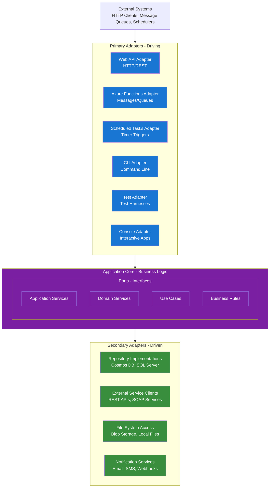

# Architectural Standards

A practical, concise guide to architecture focused on simplicity, clarity, and hexagonal (ports & adapters) design. Keep business logic pure, interfaces explicit, and adapters thin.

## What this doc is for

- Capture the minimal, repeatable architectural decisions we follow across services.
- Explain why hexagonal architecture is used and how it maps to code.
- Preserve clear naming, testability, and separation of concerns.

## Core Principles (concise)

- Address essential complexity only; remove incidental complexity.
- Avoid needless layers, abstractions, or third-party lock-in in the core.
- Prefer readable, intention-revealing code over cleverness.
- When trade-offs are necessary, prioritize maintainability and clarity.
- If requirements are ambiguous, ask for clarification rather than guessing.

## Hexagonal Architecture (Ports & Adapters)

Hexagonal architecture isolates the application core (domain + use cases) from frameworks and infrastructure. The core defines ports (interfaces) and contains business rules; adapters implement ports and translate external protocols.

- Primary (driving) ports: Controllers, message handlers, CLIs, test harnesses.
- Secondary (driven) ports: repositories, external service clients, file storage, notification services.

Dependency rule (central): dependencies point inward — adapters -> ports -> core. The core must not reference infrastructure, frameworks, or providers.

Keep ports small, intention-focused, and domain-named so the core reads like the domain language.

### Core diagram



## Ports and Adapters (practical notes)

- Primary adapters translate external inputs into application use-cases — they should be thin and delegate to application services.
- Secondary adapters implement persistence, external APIs, and other infrastructure concerns; they implement repository and client interfaces defined by the core.
- Keep translation/anti-corruption logic in adapters or dedicated anti-corruption services, not scattered through the core.

## Domain-driven Naming (rules)

Name components by domain intent first, then communication pattern, then technical detail. This improves discoverability and reduces cognitive load.

Priority examples:
1. Domain concept (what it represents)
2. Communication pattern (Publisher/Synchronizer/Command)
3. Technical descriptor only when necessary

Good:
```csharp
public class OrderSynchronizer
public class CustomerDataSynchronizer
public class InventoryAlertPublisher
public class ProductCompatibilityPublisher
public class CustomerNotificationQC
public class RegisterCustomerCommand
```
Avoid: generic names like `DataSyncService`, `EventPublisher`, `ProcessDataCommand`.

Method naming: prefer business intent — `RegisterNewCustomer()`, `FulfillOrder()`, `ReviewInventoryAlert()`.

## Testability (short)

- Unit test the core with test doubles for ports.
- Integration test adapters against real infra (or local emulators).
- Use end-to-end tests to validate cross-adapter flows and real messaging or DB interactions.

## Service Layer & Hybrid CQRS (summary)

We separate command (write) and query (read) responsibilities to optimize each side while keeping the core framework-agnostic.

- Command side: command handlers, domain aggregates, repositories (write store), domain events.
- Query side: read-model projections, SQL/read-optimized stores, query handlers, caching.
- Domain events propagate changes from the write side to read projections and external systems.

### Command Application Service (write-side)

```csharp
// Example: Command application service
public class PromotionCommandService(
    IPromotionRepository repository,
    IDomainEventPublisher eventPublisher)
{
    public async Task<Promotion> CreatePromotionAsync(string name, string description)
    {
        // Create domain aggregate
        var promotion = new Promotion(name, description);

        // Persist via repository (to Cosmos DB)
        await repository.AddAsync(promotion);

        // Publish domain events (for read model updates)
        await eventPublisher.PublishAsync(new PromotionCreatedEvent(promotion.Id, promotion.Name, promotion.Description));

        return promotion;
    }
}
```

### Query Application Service (read-side)

```csharp
// Example: Query application service
public class PromotionQueryService
{
    private readonly IDbConnectionFactory _connectionFactory;

    public PromotionQueryService(IDbConnectionFactory connectionFactory)
    {
        _connectionFactory = connectionFactory;
    }

    public async Task<PromotionReadModel> GetPromotionAsync(PromotionId id)
    {
        using var connection = await _connectionFactory.CreateConnectionAsync();
        return await connection.QuerySingleOrDefaultAsync<PromotionReadModel>(
            "SELECT Id, Name, Description, CreatedAt FROM Promotions WHERE Id = @Id",
            new { Id = id }
        );
    }

    public async Task<PagedResults<PromotionListItem>> SearchPromotionsAsync(string searchTerm, int page, int pageSize)
    {
        using var connection = await _connectionFactory.CreateConnectionAsync();

        // Complex queries with joins, filtering, pagination
        var promotions = await connection.QueryAsync<PromotionListItem>(
            @"SELECT p.Id, p.Name, p.CreatedAt, COUNT(o.Id) as OrderCount
              FROM Promotions p
              LEFT JOIN CustomerOrders o ON p.Id = o.PromotionId
              WHERE p.Name LIKE @SearchTerm
              GROUP BY p.Id, p.Name, p.CreatedAt
              ORDER BY p.CreatedAt DESC
              OFFSET @Offset ROWS FETCH NEXT @PageSize ROWS ONLY",
            new { SearchTerm = $"%{searchTerm}%", Offset = page * pageSize, PageSize = pageSize }
        );

        return new PagedResults<PromotionListItem>(promotions, page, pageSize);
    }
}
```

### Domain Event Handler (read model updates)

```csharp
public class PromotionCreatedEventHandler : IHandleEvent<PromotionCreatedEvent>
{
    private readonly IDbConnectionFactory _connectionFactory;
    private readonly IExternalNotificationService _notificationService;

    public async Task Handle(PromotionCreatedEvent @event)
    {
        using var connection = await _connectionFactory.CreateConnectionAsync();

        // Update read model directly via SQL
        await connection.ExecuteAsync(
            @"INSERT INTO Promotions (Id, Name, Description, CreatedAt, Status)
              VALUES (@Id, @Name, @Description, @CreatedAt, @Status)",
            new {
                Id = @event.PromotionId,
                Name = @event.PromotionName,
                Description = @event.Description,
                CreatedAt = @event.Timestamp,
                Status = "Active"
            }
        );

        // Update denormalized views
        await connection.ExecuteAsync(
            @"UPDATE PromotionSummary SET TotalPromotions = TotalPromotions + 1
              WHERE Category = @Category",
            new { Category = @event.PromotionCategory }
        );

        // Cross-bounded context integration
        await _notificationService.NotifyPromotionCreated(@event.PromotionId, @event.PromotionName);
    }
}
```

## Domain Layer (pure business logic)

- Entities, value objects, domain services, domain events and specifications live here.
- No persistence, no EF/ORM usage, and no framework references. The layer is testable and deterministic.

```csharp
// Example: Pure domain service
public class ProductBundleService
{
    public BundleCompatibility AssessBundleCompatibility(IEnumerable<Product> products)
    {
        // Pure business logic - no infrastructure dependencies
        var conflicts = new List<ProductConflict>();

        foreach (var product1 in products)
        {
            foreach (var product2 in products.Where(p => p != product1))
            {
                var conflict = CheckConflict(product1, product2);
                if (conflict.HasConflict)
                    conflicts.Add(conflict);
            }
        }

        return CalculateOverallCompatibility(conflicts);
    }

    private ProductConflict CheckConflict(Product product1, Product product2)
    {
        // Domain logic using business rules
        // No database calls - works with provided domain objects
    }
}
```

## Cross-bounded Context Communication

- Use anti-corruption layers (ACL) to translate external models into internal domain models and protect bounded contexts.
- Domain events are the primary mechanism to integrate between contexts; handlers update local read models or call integration adapters.

```csharp
// Example: Anti-corruption layer
public class ExternalOrderService : IIntegrateWithExternalSystem
{
    private readonly IDbConnectionFactory _connectionFactory;
    private readonly IExternalOrderApi _externalApi;

    public async Task SynchronizeExternalOrder(ExternalOrderEvent @event)
    {
        // Translate external model to internal domain concepts
        var internalOrder = TranslateToInternalModel(@event.ExternalData);

        // Update read models with translated data
        using var connection = await _connectionFactory.CreateConnectionAsync();
        await connection.ExecuteAsync(
            "INSERT INTO Orders (...) VALUES (...)",
            internalOrder
        );
    }
}
```

## Implementation Adapters (examples)

```csharp
// Web API Controller (delegates to application services)
[ApiController]
[Route("api/[controller]")]
public class PromotionsController(
    PromotionCommandService commandService,
    PromotionQueryService queryService) : ControllerBase
{
    [HttpPost]
    public async Task<IActionResult> CreatePromotion(CreatePromotionRequest request)
    {
        var promotion = await commandService.CreatePromotionAsync(request.Name, request.Description);
        return CreatedAtAction(nameof(GetPromotion), new { id = promotion.Id }, promotion);
    }

    [HttpGet("{id}")]
    public async Task<IActionResult> GetPromotion(PromotionId id)
    {
        var promotion = await queryService.GetPromotionAsync(id);
        if (promotion is null) return NotFound();
        return Ok(promotion);
    }

    [HttpGet]
    public async Task<IActionResult> SearchPromotions([FromQuery] string searchTerm, [FromQuery] int page = 0, [FromQuery] int pageSize = 20)
    {
        var results = await queryService.SearchPromotionsAsync(searchTerm, page, pageSize);
        return Ok(results);
    }
}

// Message Adapter
[Function("ProcessPromotionUpdate")]
public async Task ProcessPromotionUpdate([ServiceBusTrigger("promotions")] PromotionUpdateMessage message)
{
    var repository = _serviceProvider.GetRequiredService<IPromotionRepository>();
    var promotion = await repository.GetByIdAsync(message.PromotionId);
    promotion.Update(message.Changes);
    await repository.UpdateAsync(promotion);
}

// Test Adapter
[Test]
public async Task promotion_query_service_finds_promotion()
{
    var queryService = new PromotionQueryService(testConnectionFactory);
    var promotion = await queryService.GetPromotionAsync(promotionId);
    promotion.Should().NotBeNull();
}
```

## Benefits & Team Productivity (concise)

- Technology flexibility: change hosting or storage without touching core logic.
- Parallel development: domain and adapters can be developed independently.
- Easier refactoring and clearer ownership boundaries.
- Tests focus on behavior rather than implementation details.

## Common Implementation Mistakes (short)

Leaky abstractions and embedding business logic in adapters are typical pitfalls.

❌ Wrong:
```csharp
// Business logic depends on Entity Framework
public class PromotionService
{
    public async Task<Promotion> GetPromotionAsync(int id)
    {
        return await _dbContext.Promotions.FindAsync(id); // EF leaking into core
    }
}
```

✅ Correct:
```csharp
// Business logic uses repository interface
public class PromotionService
{
    private readonly IPromotionRepository _repository;

    public async Task<Promotion> GetPromotionAsync(PromotionId id)
    {
        return await _repository.GetByIdAsync(id); // Clean interface
    }
}
```

❌ Wrong:
```csharp
// Web handler directly using database context
public class GetPromotionHandler
{
    private readonly MyDbContext _dbContext; // Direct database dependency
}
```

✅ Correct:
```csharp
// Web handler uses application service
public class GetPromotionHandler
{
    private readonly IPromotionService _promotionService; // Clean application service
}
```

❌ Wrong (business logic in controller):
```csharp
[HttpPost]
public async Task<IActionResult> CreatePromotion(CreatePromotionRequest request)
{
    if (string.IsNullOrEmpty(request.Name)) return BadRequest();
    if (request.Name.Length > 100) return BadRequest();

    var promotion = new Promotion(request.Name);
    await _repository.AddAsync(promotion);
    return Ok(promotion);
}
```

✅ Correct (delegate to core):
```csharp
[HttpPost]
public async Task<IActionResult> CreatePromotion(CreatePromotionRequest request)
{
    var promotion = await _promotionService.CreateAsync(request); // All logic in core
    return Ok(promotion);
}
```

## Conclusion

Hexagonal architecture is a practical discipline: keep the core pure, prefer domain-first names, separate commands and queries, and keep adapters thin and testable.
