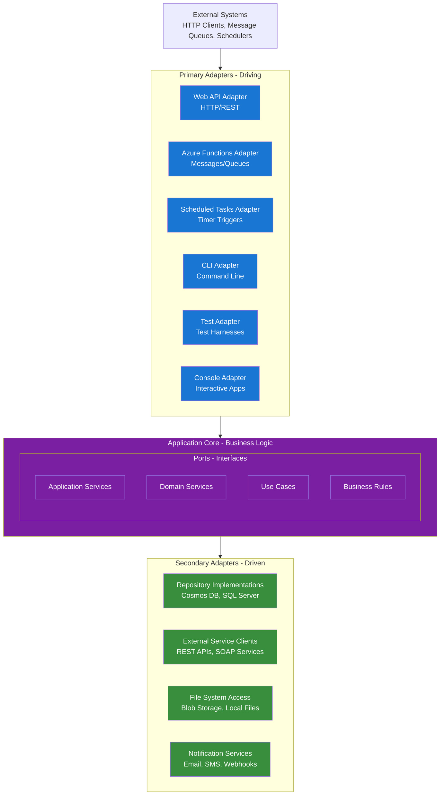

# Architectural Standards

A practical, concise guide to architecture focused on simplicity, clarity, and hexagonal (ports & adapters) design. Keep business logic pure, interfaces explicit, and adapters thin.

## What this doc is for

- Capture the minimal, repeatable architectural decisions we follow across services.
- Explain why hexagonal architecture is used and how it maps to code.
- Preserve clear naming, testability, and separation of concerns.

## Core Principles (concise)

- Address essential complexity only; remove incidental complexity.
- Avoid needless layers, abstractions, or third-party lock-in in the core.
- Prefer readable, intention-revealing code over cleverness.
- When trade-offs are necessary, prioritize maintainability and clarity.
- If requirements are ambiguous, ask for clarification rather than guessing.

## Hexagonal Architecture (Ports & Adapters)

Hexagonal architecture isolates the application core (domain + use cases) from frameworks and infrastructure. The core defines ports (interfaces) and contains business rules; adapters implement ports and translate external protocols.

- Primary (driving) ports: HTTP handlers, message handlers, CLIs, test harnesses.
- Secondary (driven) ports: repositories, external service clients, file storage, notification services.

Dependency rule (central): dependencies point inward — adapters -> ports -> core. The core must not reference infrastructure, frameworks, or providers.

Keep ports small, intention-focused, and domain-named so the core reads like the domain language.

### Core diagram



## Ports and Adapters (practical notes)

- Primary adapters translate external inputs into application use-cases — they should be thin and delegate to application services.
- Secondary adapters implement persistence, external APIs, and other infrastructure concerns; they implement repository and client interfaces defined by the core.
- Keep translation/anti-corruption logic in adapters or dedicated anti-corruption services, not scattered through the core.

## Domain-driven Naming (rules)

Name components by domain intent first, then communication pattern, then technical detail. This improves discoverability and reduces cognitive load.

Priority examples:
1. Domain concept (what it represents)
2. Communication pattern (Publisher/Synchronizer/Command)
3. Technical descriptor only when necessary

Good:
```csharp
public class PrescriptionSynchronizer
public class PatientDataSynchronizer
public class ClinicalAlertPublisher
public class DrugInteractionPublisher
public class PatientSafetyNotificationQC
public class EnrollPatientCommand
```
Avoid: generic names like `DataSyncService`, `EventPublisher`, `ProcessDataCommand`.

Method naming: prefer business intent — `EnrollNewPatient()`, `DispensePrescription()`, `ReviewClinicalAlert()`.

## Testability (short)

- Unit test the core with test doubles for ports.
- Integration test adapters against real infra (or local emulators).
- Use end-to-end tests to validate cross-adapter flows and real messaging or DB interactions.

## Service Layer & Hybrid CQRS (summary)

We separate command (write) and query (read) responsibilities to optimize each side while keeping the core framework-agnostic.

- Command side: command handlers, domain aggregates, repositories (write store), domain events.
- Query side: read-model projections, SQL/read-optimized stores, query handlers, caching.
- Domain events propagate changes from the write side to read projections and external systems.

### Command Handler (write-side)

```csharp
// Example: Web API handler for commands
public class CreateRuleHandler : IHandlePostRequests<CreateRuleRequest>
{
    private readonly IRuleRepository _repository;
    private readonly IDomainEventPublisher _eventPublisher;
    
    public async Task<PostResponse> HandleAsync(Request request, CreateRuleRequest payload)
    {
        // Create domain aggregate
        var rule = new Rule(payload.Name, payload.Description);
        
        // Persist via repository (to Cosmos DB)
        await _repository.AddAsync(rule);
        
        // Publish domain events (for read model updates)
        await _eventPublisher.PublishAsync(new RuleCreatedEvent(rule.Id, rule.Name, rule.Description));
        
        return new PostResponse(HttpStatusCode.Created, rule);
    }
}
```

### Query Application Service (read-side)

```csharp
// Example: Query application service
public class RuleQueryService
{
    private readonly IDbConnectionFactory _connectionFactory;
    
    public RuleQueryService(IDbConnectionFactory connectionFactory)
    {
        _connectionFactory = connectionFactory;
    }
    
    public async Task<RuleReadModel> GetRuleAsync(RuleId id)
    {
        using var connection = await _connectionFactory.CreateConnectionAsync();
        return await connection.QuerySingleOrDefaultAsync<RuleReadModel>(
            "SELECT Id, Name, Description, CreatedAt FROM Rules WHERE Id = @Id",
            new { Id = id }
        );
    }
    
    public async Task<PagedResults<RuleListItem>> SearchRulesAsync(string searchTerm, int page, int pageSize)
    {
        using var connection = await _connectionFactory.CreateConnectionAsync();
        
        // Complex queries with joins, filtering, pagination
        var rules = await connection.QueryAsync<RuleListItem>(
            @"SELECT r.Id, r.Name, r.CreatedAt, COUNT(p.Id) as PatientCount
              FROM Rules r 
              LEFT JOIN PatientRules p ON r.Id = p.RuleId 
              WHERE r.Name LIKE @SearchTerm 
              GROUP BY r.Id, r.Name, r.CreatedAt
              ORDER BY r.CreatedAt DESC 
              OFFSET @Offset ROWS FETCH NEXT @PageSize ROWS ONLY",
            new { SearchTerm = $"%{searchTerm}%", Offset = page * pageSize, PageSize = pageSize }
        );
        
        return new PagedResults<RuleListItem>(rules, page, pageSize);
    }
}
```

### Domain Event Handler (read model updates)

```csharp
public class RuleCreatedEventHandler : IHandleEvent<RuleCreatedEvent>
{
    private readonly IDbConnectionFactory _connectionFactory;
    private readonly IExternalNotificationService _notificationService;
    
    public async Task Handle(RuleCreatedEvent @event)
    {
        using var connection = await _connectionFactory.CreateConnectionAsync();
        
        // Update read model directly via SQL
        await connection.ExecuteAsync(
            @"INSERT INTO Rules (Id, Name, Description, CreatedAt, Status) 
              VALUES (@Id, @Name, @Description, @CreatedAt, @Status)",
            new { 
                Id = @event.RuleId, 
                Name = @event.RuleName,
                Description = @event.Description,
                CreatedAt = @event.Timestamp,
                Status = "Active"
            }
        );
        
        // Update denormalized views
        await connection.ExecuteAsync(
            @"UPDATE RuleSummary SET TotalRules = TotalRules + 1 
              WHERE Category = @Category",
            new { Category = @event.RuleCategory }
        );
        
        // Cross-bounded context integration
        await _notificationService.NotifyRuleCreated(@event.RuleId, @event.RuleName);
    }
}
```

## Domain Layer (pure business logic)

- Entities, value objects, domain services, domain events and specifications live here.
- No persistence, no EF/ORM usage, and no framework references. The layer is testable and deterministic.

```csharp
// Example: Pure domain service
public class DrugInteractionService
{
    public InteractionRisk AssessInteractionRisk(IEnumerable<Medication> medications)
    {
        // Pure business logic - no infrastructure dependencies
        var interactions = new List<DrugInteraction>();
        
        foreach (var med1 in medications)
        {
            foreach (var med2 in medications.Where(m => m != med1))
            {
                var interaction = CheckInteraction(med1, med2);
                if (interaction.HasRisk)
                    interactions.Add(interaction);
            }
        }
        
        return CalculateOverallRisk(interactions);
    }
    
    private DrugInteraction CheckInteraction(Medication med1, Medication med2)
    {
        // Domain logic using business rules
        // No database calls - works with provided domain objects
    }
}
```

## Cross-bounded Context Communication

- Use anti-corruption layers (ACL) to translate external models into internal domain models and protect bounded contexts.
- Domain events are the primary mechanism to integrate between contexts; handlers update local read models or call integration adapters.

```csharp
// Example: Anti-corruption layer
public class ExternalPrescriptionService : IIntegrateWithExternalSystem
{
    private readonly IDbConnectionFactory _connectionFactory;
    private readonly IExternalPrescriptionApi _externalApi;
    
    public async Task SynchronizeExternalPrescription(ExternalPrescriptionEvent @event)
    {
        // Translate external model to internal domain concepts
        var internalPrescription = TranslateToInternalModel(@event.ExternalData);
        
        // Update read models with translated data
        using var connection = await _connectionFactory.CreateConnectionAsync();
        await connection.ExecuteAsync(
            "INSERT INTO Prescriptions (...) VALUES (...)",
            internalPrescription
        );
    }
}
```

## Implementation Adapters (examples)

```csharp
// Web API Adapter (Command)
public class CreateRuleHandler : IHandlePostRequests<CreateRuleRequest>
{
    private readonly IRuleRepository _repository;
    
    public async Task<PostResponse> HandleAsync(Request request, CreateRuleRequest payload)
    {
        var rule = new Rule(payload.Name, payload.Description);
        await _repository.AddAsync(rule);
        return new PostResponse(HttpStatusCode.Created, rule);
    }
}

// Web API Adapter (Query)
public class GetRuleHandler : IHandleGetRequests
{
    private readonly RuleQueryService _queryService;
    
    public async Task<object> HandleAsync(Request request)
    {
        return await _queryService.GetRuleAsync(request.RuleId());
    }
}

// Message Adapter
[Function("ProcessRuleUpdate")]
public async Task ProcessRuleUpdate([ServiceBusTrigger("rules")] RuleUpdateMessage message)
{
    var repository = _serviceProvider.GetRequiredService<IRuleRepository>();
    var rule = await repository.GetByIdAsync(message.RuleId);
    rule.Update(message.Changes);
    await repository.UpdateAsync(rule);
}

// Test Adapter
[Test]
public async Task rule_query_service_finds_rule()
{
    var queryService = new RuleQueryService(testConnectionFactory);
    var rule = await queryService.GetRuleAsync(ruleId);
    rule.Should().NotBeNull();
}
```

## Benefits & Team Productivity (concise)

- Technology flexibility: change hosting or storage without touching core logic.
- Parallel development: domain and adapters can be developed independently.
- Easier refactoring and clearer ownership boundaries.
- Tests focus on behavior rather than implementation details.

## Common Implementation Mistakes (short)

Leaky abstractions and embedding business logic in adapters are typical pitfalls.

❌ Wrong:
```csharp
// Business logic depends on Entity Framework
public class RuleService
{
    public async Task<Rule> GetRuleAsync(int id)
    {
        return await _dbContext.Rules.FindAsync(id); // EF leaking into core
    }
}
```

✅ Correct:
```csharp
// Business logic uses repository interface
public class RuleService
{
    private readonly IRuleRepository _repository;
    
    public async Task<Rule> GetRuleAsync(RuleId id)
    {
        return await _repository.GetByIdAsync(id); // Clean interface
    }
}
```

❌ Wrong:
```csharp
// Web handler directly using database context
public class GetRuleHandler
{
    private readonly MyDbContext _dbContext; // Direct database dependency
}
```

✅ Correct:
```csharp
// Web handler uses application service
public class GetRuleHandler
{
    private readonly IRuleService _ruleService; // Clean application service
}
```

❌ Wrong (business logic in controller):
```csharp
[HttpPost]
public async Task<IActionResult> CreateRule(CreateRuleRequest request)
{
    if (string.IsNullOrEmpty(request.Name)) return BadRequest();
    if (request.Name.Length > 100) return BadRequest();
    
    var rule = new Rule(request.Name);
    await _repository.AddAsync(rule);
    return Ok(rule);
}
```

✅ Correct (delegate to core):
```csharp
[HttpPost]
public async Task<IActionResult> CreateRule(CreateRuleRequest request)
{
    var rule = await _ruleService.CreateAsync(request); // All logic in core
    return Ok(rule);
}
```

## Conclusion

Hexagonal architecture is a practical discipline: keep the core pure, prefer domain-first names, separate commands and queries, and keep adapters thin and testable.
