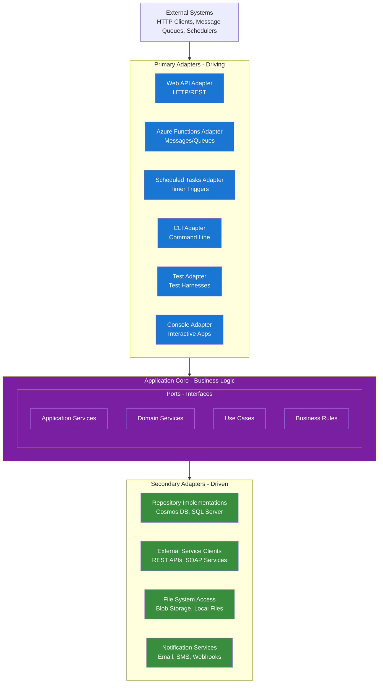
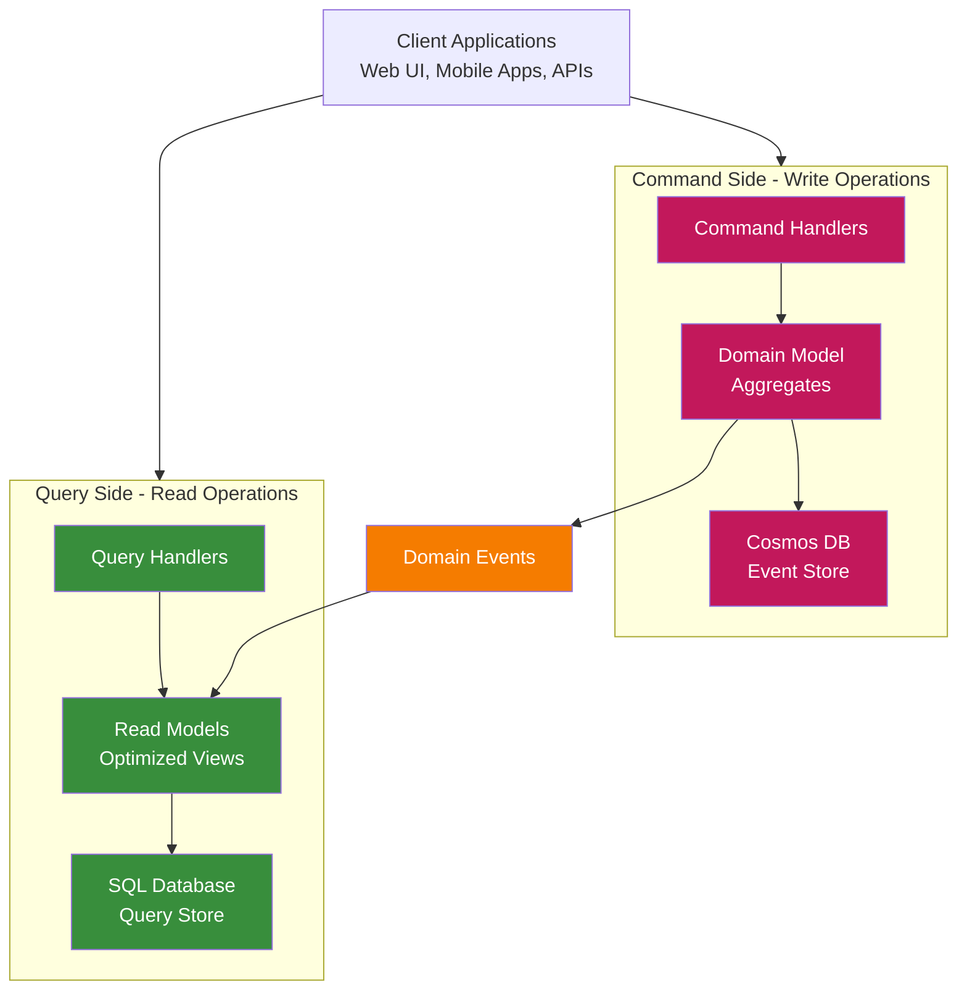

# Hexagonal Architecture Standards

## 1. Overview

This document defines the hexagonal architecture principles that guide project design. Hexagonal architecture (also known as ports and adapters) provides clean separation between business logic and infrastructure concerns, enabling technology independence, testability, and maintainability.

## 1.1. What is Hexagonal Architecture?

Hexagonal architecture is an architectural pattern that isolates the core business logic from external concerns. The "hexagon" represents the application core, with each side representing a different way the application can be driven (HTTP, messages, timers) or drive other systems (databases, external APIs, file systems).

### 1.1.1. Core Architecture Diagram



## 1.2. Core Concepts

### Ports
**Ports** are interfaces that define how the application can be used or how it uses external systems.

- **Primary Ports** (Driving): Interfaces that allow external systems to use the application
  - HTTP request handlers
  - Message handlers
  - CLI command interfaces
- **Secondary Ports** (Driven): Interfaces that the application uses to interact with external systems
  - Repository interfaces
  - External service interfaces
  - Notification interfaces

### Adapters
**Adapters** are implementations that connect ports to real technologies.

- **Primary Adapters** (Driving): Translate external inputs into application calls
  - Web API controllers/handlers
  - Azure Functions (Service Bus, Timer triggers)
  - Console application main methods
  - Test harnesses
- **Secondary Adapters** (Driven): Implement interfaces needed by the application
  - Database repositories (Cosmos DB, SQL Server)
  - External service clients (REST APIs, SOAP services)
  - File system implementations
  - Email/SMS notification services

## 2. Hexagonal Architecture Principles

### 2.1. Dependency Rule

The fundamental rule of hexagonal architecture is the **Dependency Rule**:

> **Dependencies point inward toward the application core. Outer layers depend on inner layers, but inner layers never depend on outer layers.**

```
External Systems → Adapters → Ports → Application Core
```

**This means:**
- Adapters depend on ports (interfaces)
- Application core defines ports but doesn't know about adapters
- External systems interact with adapters, not the core directly

### 2.2. Technology Independence

The application core should be completely independent of:
- **Frameworks**: No ASP.NET, Entity Framework, or Azure-specific code in the core
- **Databases**: Business logic doesn't know if data comes from SQL Server, Cosmos DB, or files
- **External Services**: Core doesn't know about specific APIs or messaging systems
- **User Interface**: Business logic works with any presentation layer

### 2.3. Domain-Driven Naming

All components should be named to reflect their **domain purpose** and **business intent**, not their technical implementation. Names should be meaningful to healthcare domain experts and express what the component achieves in the business context.

#### 2.3.1. Naming Hierarchy

**Priority Order for Naming:**
1. **Domain Concept**: What it represents in healthcare/pharmacy domain
2. **Communication Pattern**: How it communicates (when relevant)
3. **Technical Distinction**: Only when absolutely necessary

#### 2.3.2. Communication Pattern Naming

When components need to communicate across boundaries, use these established patterns:

**Synchronization**: Inter-connected component coordination
```csharp
// GOOD: Domain + Communication Pattern
public class PrescriptionSynchronizer
public class PatientDataSynchronizer
public class FormularySynchronizer

// AVOID: Technical focus
public class DataSyncService
public class MessageProcessor
```

**Publication**: Broader messaging (one-to-many distribution)
```csharp
// GOOD: Domain + Publication Pattern
public class ClinicalAlertPublisher
public class DrugInteractionPublisher
public class ComplianceReportPublisher

// AVOID: Generic messaging terms
public class EventPublisher
public class MessageBroadcaster
```

**QC'd (Quality Controlled)**: External world notifications
```csharp
// GOOD: Domain + QC Pattern
public class PatientSafetyNotificationQC
public class RegulatoryReportQC
public class PharmacyAlertQC

// AVOID: Generic notification terms
public class ExternalNotifier
public class OutboundMessageHandler
```

**Commands**: Specific component-to-component instructions
```csharp
// GOOD: Domain + Command Pattern
public class EnrollPatientCommand
public class DispenseMedicationCommand  
public class ValidatePrescriptionCommand

// AVOID: CRUD or generic operations
public class CreatePatientCommand
public class ProcessDataCommand
```

#### 2.3.3. Service Naming Standards

**Domain Services** (Express business capabilities):
```csharp
// GOOD: Clear domain responsibility
public class DrugInteractionEngine
public class PrescriptionValidator
public class ClinicalRuleEngine
public class PatientEligibilityChecker
public class FormularyManager

// AVOID: Generic "Service" suffix
public class ValidationService
public class RuleService  
public class DataService
```

**Application Services** (Express use cases):
```csharp
// GOOD: Business use case focus
public class PrescriptionDispenser
public class PatientEnroller
public class ClinicalReviewCoordinator
public class DrugSafetyAnalyzer

// AVOID: Technical operation focus
public class PrescriptionProcessor
public class PatientHandler
public class ReviewManager
```

#### 2.3.4. Method Naming Standards

Methods should express **business operations**, not technical operations:

```csharp
// GOOD: Healthcare domain operations
EnrollNewPatient()
DispensePrescription()
ValidateDrugInteractions()
GenerateComplianceReport()
ReviewClinicalAlert()

// AVOID: Technical CRUD operations
CreatePatient()
UpdatePrescription()
DeleteRecord()
ProcessData()
```

### 2.4. Testability

Hexagonal architecture makes testing straightforward:
- **Unit Tests**: Test application core in isolation using test doubles
- **Integration Tests**: Test adapters against real external systems
- **End-to-End Tests**: Test complete system with real adapters

## 3. Service Layer Patterns

We implements a **Hybrid CQRS** approach that separates command (write) operations from query (read) operations while maintaining clean architecture principles.

### 3.1. CQRS Architecture



### 3.2. Service Layer Responsibilities and Access Patterns

#### **Command Handlers** (Write Operations)
**Purpose**: Execute domain operations and maintain aggregate consistency
**Infrastructure Access**:
- ✅ **Domain Repositories**: For persisting aggregates to Cosmos DB
- ✅ **Domain Services**: For complex business logic
- ✅ **Domain Event Publishing**: To notify read-side updates
- ❌ **Direct SQL Access**: Use repositories for data persistence
- ❌ **Read Model Queries**: Commands shouldn't query read models

```csharp
// Example: Web API handler for commands
public class CreateRuleHandler : IHandlePostRequests<CreateRuleRequest>
{
    private readonly IRuleRepository _repository;
    private readonly IDomainEventPublisher _eventPublisher;
    
    public async Task<PostResponse> HandleAsync(Request request, CreateRuleRequest payload)
    {
        // Create domain aggregate
        var rule = new Rule(payload.Name, payload.Description);
        
        // Persist via repository (to Cosmos DB)
        await _repository.AddAsync(rule);
        
        // Publish domain events (for read model updates)
        await _eventPublisher.PublishAsync(new RuleCreatedEvent(rule.Id, rule.Name, rule.Description));
        
        return new PostResponse(HttpStatusCode.Created, rule);
    }
}
```

#### **Query Application Services** (Read Operations)
**Purpose**: Provide optimized data access for read scenarios
**Infrastructure Access**:
- ✅ **Direct IDb Access**: For optimized SQL queries against read models
- ✅ **Read Model DTOs**: Work with SQL-based projections
- ✅ **Cross-aggregate Queries**: Join data from multiple sources efficiently
- ✅ **Caching Infrastructure**: For performance optimization
- ❌ **Domain Repositories**: Don't access write-side storage
- ❌ **Domain Entities**: Work with read models, not domain objects

```csharp
// Example: Query application service
public class RuleQueryService
{
    private readonly IDbConnectionFactory _connectionFactory;
    
    public RuleQueryService(IDbConnectionFactory connectionFactory)
    {
        _connectionFactory = connectionFactory;
    }
    
    public async Task<RuleReadModel> GetRuleAsync(RuleId id)
    {
        using var connection = await _connectionFactory.CreateConnectionAsync();
        return await connection.QuerySingleOrDefaultAsync<RuleReadModel>(
            "SELECT Id, Name, Description, CreatedAt FROM Rules WHERE Id = @Id",
            new { Id = id }
        );
    }
    
    public async Task<PagedResults<RuleListItem>> SearchRulesAsync(string searchTerm, int page, int pageSize)
    {
        using var connection = await _connectionFactory.CreateConnectionAsync();
        
        // Complex queries with joins, filtering, pagination
        var rules = await connection.QueryAsync<RuleListItem>(
            @"SELECT r.Id, r.Name, r.CreatedAt, COUNT(p.Id) as PatientCount
              FROM Rules r 
              LEFT JOIN PatientRules p ON r.Id = p.RuleId 
              WHERE r.Name LIKE @SearchTerm 
              GROUP BY r.Id, r.Name, r.CreatedAt
              ORDER BY r.CreatedAt DESC 
              OFFSET @Offset ROWS FETCH NEXT @PageSize ROWS ONLY",
            new { SearchTerm = $"%{searchTerm}%", Offset = page * pageSize, PageSize = pageSize }
        );
        
        return new PagedResults<RuleListItem>(rules, page, pageSize);
    }
}
```

#### **Domain Event Handlers** (Application Services)
**Purpose**: Maintain read model consistency by reacting to domain events
**Infrastructure Access**:
- ✅ **Direct IDb Access**: For updating SQL read models
- ✅ **Domain Event Processing**: Consume events from write side
- ✅ **External Service Integration**: For cross-system synchronization
- ✅ **Message Publishing**: For cross-bounded context integration
- ❌ **Domain Repositories**: Don't access write-side storage
- ❌ **Command Operations**: Event handlers are read-side concerns

```csharp
// Example: Domain event handler maintaining read model consistency
public class RuleCreatedEventHandler : IHandleEvent<RuleCreatedEvent>
{
    private readonly IDbConnectionFactory _connectionFactory;
    private readonly IExternalNotificationService _notificationService;
    
    public async Task Handle(RuleCreatedEvent @event)
    {
        using var connection = await _connectionFactory.CreateConnectionAsync();
        
        // Update read model directly via SQL
        await connection.ExecuteAsync(
            @"INSERT INTO Rules (Id, Name, Description, CreatedAt, Status) 
              VALUES (@Id, @Name, @Description, @CreatedAt, @Status)",
            new { 
                Id = @event.RuleId, 
                Name = @event.RuleName,
                Description = @event.Description,
                CreatedAt = @event.Timestamp,
                Status = "Active"
            }
        );
        
        // Update denormalized views
        await connection.ExecuteAsync(
            @"UPDATE RuleSummary SET TotalRules = TotalRules + 1 
              WHERE Category = @Category",
            new { Category = @event.RuleCategory }
        );
        
        // Cross-bounded context integration
        await _notificationService.NotifyRuleCreated(@event.RuleId, @event.RuleName);
    }
}
```

### 3.3. Domain Layer (Pure Business Logic)
**Purpose**: Core business logic and domain rules
**Infrastructure Access**:
- ✅ **Other Domain Objects**: Entities, value objects, domain services within context
- ✅ **Domain Events**: Can raise events about business state changes
- ✅ **Domain Specifications**: Business rules and validation logic
- ❌ **Any Infrastructure**: No databases, external services, or technical concerns
- ❌ **Cross-Context Access**: Stay within bounded context boundaries
- ❌ **Application Layer Concerns**: No transaction or persistence logic

```csharp
// Example: Pure domain service
public class DrugInteractionService
{
    public InteractionRisk AssessInteractionRisk(IEnumerable<Medication> medications)
    {
        // Pure business logic - no infrastructure dependencies
        var interactions = new List<DrugInteraction>();
        
        foreach (var med1 in medications)
        {
            foreach (var med2 in medications.Where(m => m != med1))
            {
                var interaction = CheckInteraction(med1, med2);
                if (interaction.HasRisk)
                    interactions.Add(interaction);
            }
        }
        
        return CalculateOverallRisk(interactions);
    }
    
    private DrugInteraction CheckInteraction(Medication med1, Medication med2)
    {
        // Domain logic using business rules
        // No database calls - works with provided domain objects
    }
}
```

### 3.4. Cross-Bounded Context Communication

**Anti-Corruption Layers**:
- Application services that translate between bounded contexts
- Protect domain integrity by converting external models
- Can have infrastructure access for external system integration

**Domain Event Integration**:
- Events cross context boundaries through infrastructure
- Event handlers update local read models based on external events
- Maintains loose coupling between contexts

```csharp
// Example: Anti-corruption layer
public class ExternalPrescriptionService : IIntegrateWithExternalSystem
{
    private readonly IDbConnectionFactory _connectionFactory;
    private readonly IExternalPrescriptionApi _externalApi;
    
    public async Task SynchronizeExternalPrescription(ExternalPrescriptionEvent @event)
    {
        // Translate external model to internal domain concepts
        var internalPrescription = TranslateToInternalModel(@event.ExternalData);
        
        // Update read models with translated data
        using var connection = await _connectionFactory.CreateConnectionAsync();
        await connection.ExecuteAsync(
            "INSERT INTO Prescriptions (...) VALUES (...)",
            internalPrescription
        );
    }
}
```

### 3.5. Implementation Examples

Different ways to drive the application core:

**Web API Adapter (Command):**
```csharp
// HTTP handler that uses repository for commands
public class CreateRuleHandler : IHandlePostRequests<CreateRuleRequest>
{
    private readonly IRuleRepository _repository;
    
    public async Task<PostResponse> HandleAsync(Request request, CreateRuleRequest payload)
    {
        var rule = new Rule(payload.Name, payload.Description);
        await _repository.AddAsync(rule);
        return new PostResponse(HttpStatusCode.Created, rule);
    }
}
```

**Web API Adapter (Query):**
```csharp
// HTTP handler that uses query service for reads
public class GetRuleHandler : IHandleGetRequests
{
    private readonly RuleQueryService _queryService;
    
    public async Task<object> HandleAsync(Request request)
    {
        return await _queryService.GetRuleAsync(request.RuleId());
    }
}
```

**Message Adapter:**
```csharp
// Service Bus function that uses same application service
[Function("ProcessRuleUpdate")]
public async Task ProcessRuleUpdate([ServiceBusTrigger("rules")] RuleUpdateMessage message)
{
    var repository = _serviceProvider.GetRequiredService<IRuleRepository>();
    var rule = await repository.GetByIdAsync(message.RuleId);
    rule.Update(message.Changes);
    await repository.UpdateAsync(rule);
}
```

**Test Adapter:**
```csharp
// Direct test of application service
[Test]
public async Task rule_query_service_finds_rule()
{
    var queryService = new RuleQueryService(testConnectionFactory);
    var rule = await queryService.GetRuleAsync(ruleId);
    rule.Should().NotBeNull();
}
```

## 4. Benefits in Context

### 4.1. Technology Flexibility

We can easily:
- Switch between hosting mechanisms (Web API ↔ Azure Functions)
- Change databases (SQL Server ↔ Cosmos DB) without changing business logic
- Add new interfaces (mobile apps, desktop apps) without core changes
- Migrate to new cloud providers or frameworks

### 4.2. Testing Strategy

- **Fast Unit Tests**: Test business logic without any infrastructure
- **Focused Integration Tests**: Test each adapter independently
- **Reliable Tests**: Mock external dependencies easily
- **BDD Alignment**: Test behavior, not implementation details

### 4.3. Team Productivity

- **Clear Boundaries**: Teams know where to put different types of code
- **Parallel Development**: Core and adapter development can proceed independently
- **Easier Refactoring**: Changes to infrastructure don't affect business logic
- **Domain Focus**: Developers can focus on healthcare domain problems

## 5. Common Implementation Mistakes

### 5.1. Leaky Abstractions

**❌ Wrong:**
```csharp
// Business logic depends on Entity Framework
public class RuleService
{
    public async Task<Rule> GetRuleAsync(int id)
    {
        return await _dbContext.Rules.FindAsync(id); // EF leaking into core
    }
}
```

**✅ Correct:**
```csharp
// Business logic uses repository interface
public class RuleService
{
    private readonly IRuleRepository _repository;
    
    public async Task<Rule> GetRuleAsync(RuleId id)
    {
        return await _repository.GetByIdAsync(id); // Clean interface
    }
}
```

### 5.2. Adapter Coupling

**❌ Wrong:**
```csharp
// Web handler directly using database context
public class GetRuleHandler
{
    private readonly MyDbContext _dbContext; // Direct database dependency
}
```

**✅ Correct:**
```csharp
// Web handler uses application service
public class GetRuleHandler
{
    private readonly IRuleService _ruleService; // Clean application service
}
```

### 5.3. Business Logic in Adapters

**❌ Wrong:**
```csharp
// Business logic in controller
[HttpPost]
public async Task<IActionResult> CreateRule(CreateRuleRequest request)
{
    if (string.IsNullOrEmpty(request.Name)) return BadRequest(); // Validation in adapter
    if (request.Name.Length > 100) return BadRequest();
    
    var rule = new Rule(request.Name);
    await _repository.AddAsync(rule); // Direct repository usage
    return Ok(rule);
}
```

**✅ Correct:**
```csharp
// Clean adapter delegates to application core
[HttpPost]
public async Task<IActionResult> CreateRule(CreateRuleRequest request)
{
    var rule = await _ruleService.CreateAsync(request); // All logic in core
    return Ok(rule);
}
```

## Conclusion

Hexagonal architecture is not just a pattern - it's a mindset that keeps business logic pure and adaptable. By following these principles, applications remain flexible, testable, and aligned with domain-driven design practices. The separation of concerns enables teams to focus on solving healthcare domain problems while keeping infrastructure concerns cleanly isolated.
